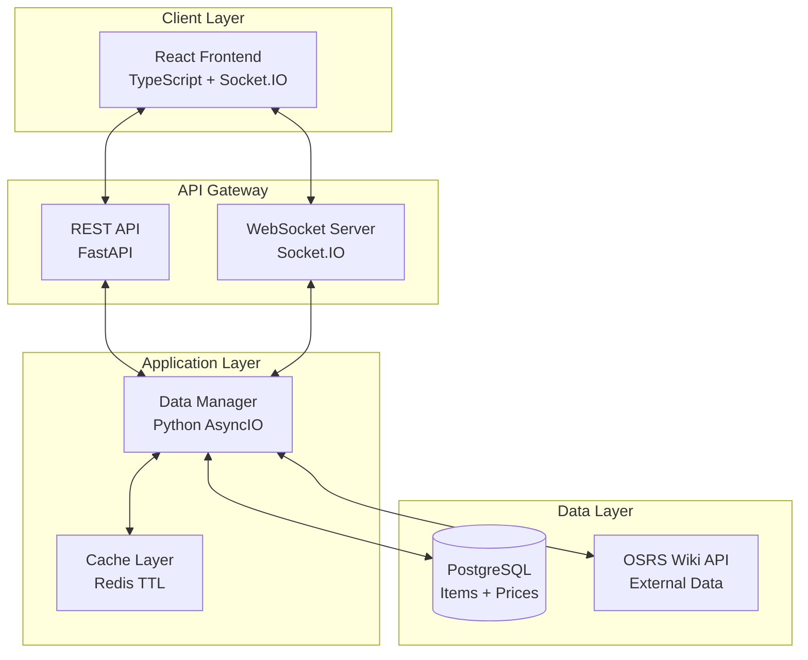
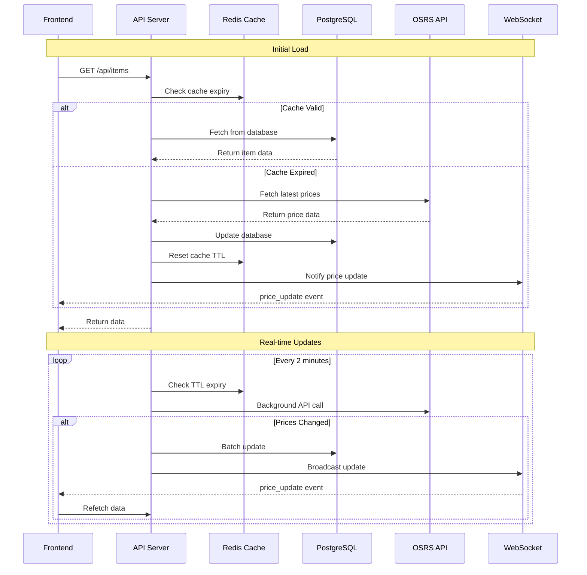

# 🏗️ OSRS Price Tracker - High Level Design

**Author: Archit Sahay**

## 📋 Project Overview

The OSRS Price Tracker is a **real-time web application** that monitors and displays live Grand Exchange prices for Old School RuneScape items. The system is designed as a **cache-driven, event-based architecture** that ensures users always see up-to-date pricing information without manual refresh.

## 🎯 Core Requirements

### Functional Requirements
- **Real-time price updates** for 4,276+ OSRS items
- **Advanced filtering and search** capabilities
- **Historical price tracking** with timestamps
- **Responsive web interface** for desktop and mobile
- **Live notifications** when prices change

### Non-Functional Requirements
- **Low latency** - Sub-second UI updates
- **High availability** - 99.9% uptime target
- **Scalability** - Handle multiple concurrent users
- **Data consistency** - PostgreSQL as source of truth
- **Performance** - Efficient caching to minimize API calls

## 🏛️ System Architecture

### Architecture Pattern: **Cache-Aside with Event-Driven Updates**



## 🔄 Data Flow Architecture

### Primary Data Flow: **Cache-First Strategy**



## 🧩 Component Design

### 1. Frontend Layer (React + TypeScript)

**Architecture**: Component-based with custom hooks

```typescript
// Core Components
App.tsx              // Main application container
├── ItemTable.tsx    // Price display table
├── SearchBar.tsx    // Search and filter controls
├── StatusBar.tsx    // Connection status indicator
└── hooks/
    ├── useSocket.ts     // WebSocket connection management
    ├── useItems.ts      // Data fetching and state
    └── useFilters.ts    // Search and filter logic
```

**Key Design Decisions**:
- **React 18** with concurrent features for better UX
- **TypeScript** for type safety and developer experience
- **Custom hooks** for state management and side effects
- **Memoization** with `useMemo` for performance optimization
- **Debounced search** to prevent excessive re-renders

### 2. Backend Layer (FastAPI + Python)

**Architecture**: Layered architecture with dependency injection

```python
# Application Structure
main.py              # Application entry point + lifespan management
├── routes.py        # REST API endpoints
├── socket_manager.py # WebSocket event handling
├── database.py      # Data access layer + business logic
├── models.py        # Pydantic data models
└── config.py        # Environment configuration
```

**Key Design Decisions**:
- **FastAPI** for modern async Python web framework
- **AsyncIO** for non-blocking I/O operations
- **Pydantic** for data validation and serialization
- **Dependency injection** for testability and modularity
- **Lifespan events** for proper startup/shutdown management

### 3. Data Layer Design

#### PostgreSQL Schema Design

```sql
-- Static item metadata (4,276 items)
CREATE TABLE items (
    id INTEGER PRIMARY KEY,           -- OSRS item ID
    name VARCHAR(255) NOT NULL,       -- Item name
    examine TEXT,                     -- Description
    members BOOLEAN,                  -- Members vs F2P
    lowalch INTEGER,                  -- Low alchemy value
    highalch INTEGER,                 -- High alchemy value
    limit_value INTEGER,              -- Buy limit
    value INTEGER,                    -- Shop value
    icon VARCHAR(255),                -- Icon URL
    created_at TIMESTAMP DEFAULT NOW(),
    updated_at TIMESTAMP DEFAULT NOW()
);

-- Dynamic price data (updated every 2 minutes)
CREATE TABLE prices (
    item_id INTEGER PRIMARY KEY REFERENCES items(id),
    high_price INTEGER,               -- Instant buy price
    high_time BIGINT,                -- Unix timestamp
    low_price INTEGER,                -- Instant sell price  
    low_time BIGINT,                 -- Unix timestamp
    last_updated TIMESTAMP DEFAULT NOW()
);
```

**Schema Design Principles**:
- **Normalized design** - Separate static and dynamic data
- **Foreign key constraints** - Data integrity
- **Timestamp tracking** - For change detection
- **Indexed columns** - Fast lookups by ID and name

#### Redis Cache Strategy

```python
# Cache Structure
KEY: "items_cache"
TTL: 120 seconds (2 minutes)
VALUE: timestamp of last API call

# Cache Logic
if not exists("items_cache") or ttl("items_cache") < 0:
    fetch_from_osrs_api()
    set("items_cache", current_timestamp, ex=120)
    update_database()
    notify_websocket_clients()
```

**Cache Design Principles**:
- **TTL-based expiry** - Automatic cache invalidation
- **Simple key structure** - Easy to manage and debug
- **Timestamp-based** - Efficient change detection
- **Failover handling** - Database fallback when cache unavailable

## 🚀 Performance Optimization Strategy

### Backend Optimizations

1. **Efficient Change Detection**
   ```python
   # Compare timestamps, not prices (faster)
   if api_timestamp > db_timestamp:
       update_required = True
   ```

2. **Batch Database Operations**
   ```python
   # Single transaction for multiple updates
   async with db.transaction():
       await db.executemany(update_query, price_updates)
   ```

3. **Async Lock Mechanism**
   ```python
   # Prevent concurrent API calls
   async with price_update_lock:
       await fetch_osrs_prices()
   ```

4. **Connection Pooling**
   ```python
   # Reuse database connections
   asyncpg.create_pool(min_size=5, max_size=20)
   ```

### Frontend Optimizations

1. **Memoized Computations**
   ```typescript
   const filteredItems = useMemo(() => 
       items.filter(item => item.name.includes(search)), 
       [items, search]
   );
   ```

2. **Debounced Search**
   ```typescript
   const debouncedSearch = useDebounce(searchTerm, 300);
   ```

3. **Virtual Scrolling** (for large datasets)
   ```typescript
   // Render only visible rows
   const visibleItems = items.slice(startIndex, endIndex);
   ```

## 🔐 Security & Reliability

### Security Measures
- **CORS Configuration** - Restrict cross-origin requests
- **Input Validation** - Pydantic models for API inputs
- **SQL Injection Prevention** - Parameterized queries
- **Environment Variables** - Secure credential management

### Reliability Features
- **Health Checks** - Docker container monitoring
- **Graceful Shutdown** - Proper resource cleanup
- **Error Handling** - Comprehensive try-catch blocks
- **Logging** - Structured logging for debugging
- **Connection Retry** - Automatic reconnection logic

## 📊 Monitoring & Observability

### Health Check Endpoints
```python
GET /api/health
{
    "status": "healthy",
    "database": "connected",
    "redis": "connected", 
    "osrs_api": "responsive",
    "uptime": "2h 15m",
    "items_count": 4276,
    "last_update": "2024-01-15T10:30:00Z"
}
```

### Key Metrics to Monitor
- **API Response Time** - Backend performance
- **WebSocket Connections** - Active user count
- **Database Query Time** - Data layer performance
- **Cache Hit Rate** - Cache effectiveness
- **OSRS API Errors** - External dependency health

## 🏗️ Deployment Architecture

### Docker Compose Multi-Service Setup

```yaml
# Service Dependencies
frontend (port 3000)
  └─ depends_on: backend
    
backend (port 8000)  
  └─ depends_on: [postgres, redis]
    
postgres (port 5432)
  └─ persistent volume
    
redis (port 6379)
  └─ in-memory cache
```

### Container Health Checks
- **Database** - `pg_isready` command
- **Cache** - `redis-cli ping` command  
- **Backend** - HTTP health endpoint
- **Frontend** - Process health check

## 🔄 Data Synchronization Strategy

### Update Frequency Management
```python
CACHE_TTL = 120  # 2 minutes between API calls
```

### Change Detection Algorithm
```python
def detect_changes(api_data, db_data):
    """Efficient timestamp-based change detection"""
    changes = []
    for item_id, api_item in api_data.items():
        db_item = db_data.get(item_id)
        if not db_item or api_item['timestamp'] > db_item['timestamp']:
            changes.append(item_id)
    return changes
```

### WebSocket Event Flow
```javascript
// Frontend WebSocket handling
socket.on('price_update', (data) => {
    console.log(`${data.count} items updated`);
    refetchItems();  // Trigger data refresh
});
```

## 🎯 Design Trade-offs & Decisions

### 1. Cache-Aside vs Write-Through
**Chosen**: Cache-Aside
**Reason**: Better control over when external APIs are called

### 2. WebSocket vs Server-Sent Events
**Chosen**: WebSocket (Socket.IO)
**Reason**: Bi-directional communication and better browser support

### 3. PostgreSQL vs MongoDB
**Chosen**: PostgreSQL
**Reason**: ACID compliance and complex query support

### 4. REST vs GraphQL
**Chosen**: REST
**Reason**: Simpler for this use case, less complexity

### 5. Pull vs Push for Updates
**Chosen**: Hybrid (Pull + Push notification)
**Reason**: Balance between server load and real-time updates

## 🚀 Future Enhancements

### Phase 2 Features
- **Price Alerts** - User-defined price thresholds
- **Historical Charts** - Price trend visualization
- **API Rate Limiting** - Prevent abuse
- **User Authentication** - Personalized experience

### Scalability Improvements
- **Horizontal Scaling** - Multiple backend instances
- **Database Sharding** - Distribute data across nodes
- **CDN Integration** - Static asset delivery
- **Microservices** - Split into focused services

## 📈 Success Metrics

### Performance KPIs
- **Page Load Time** < 2 seconds
- **Price Update Latency** < 5 seconds
- **API Response Time** < 500ms
- **WebSocket Connection Success** > 99%

### Business KPIs  
- **User Engagement** - Session duration
- **Data Accuracy** - Price consistency with OSRS
- **System Uptime** - 99.9% availability
- **User Satisfaction** - Feedback scores

---

This high-level design document serves as the architectural blueprint for the OSRS Price Tracker, emphasizing **performance**, **reliability**, and **real-time capabilities** through modern web technologies and thoughtful system design. 